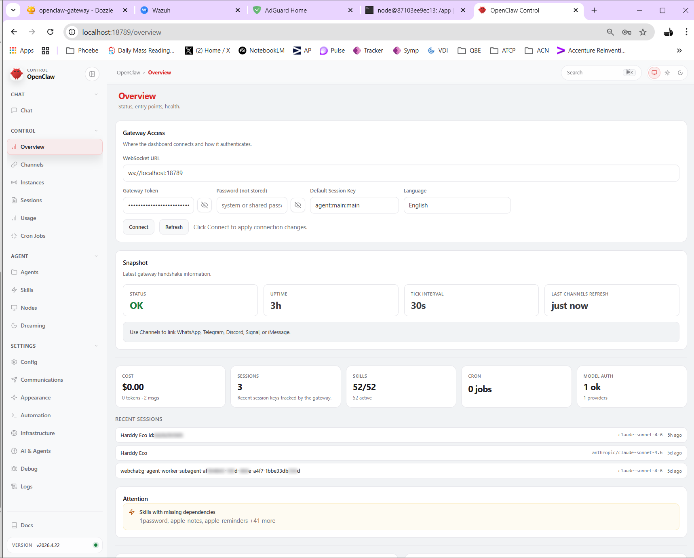
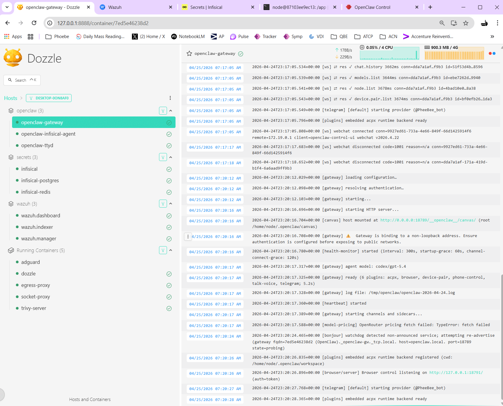
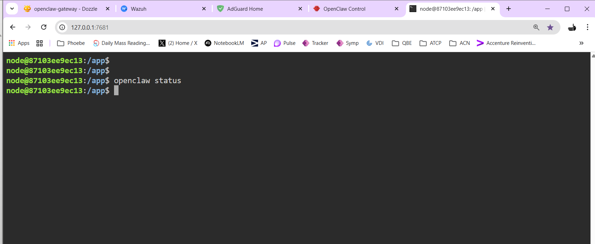
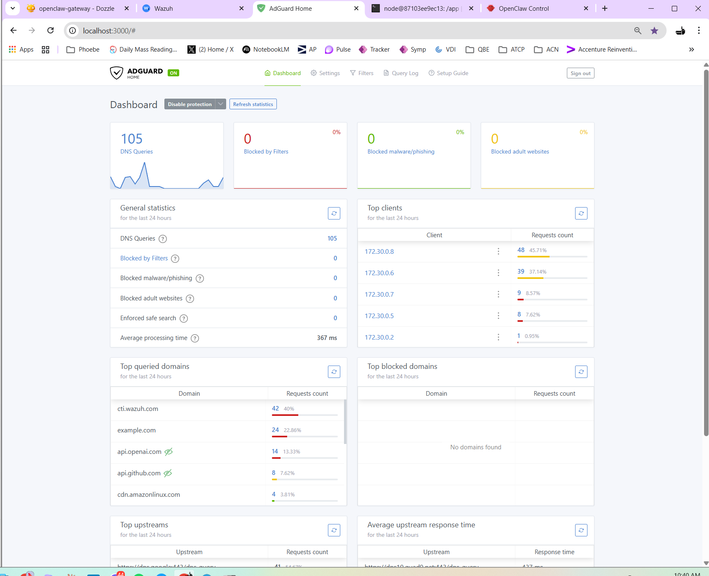
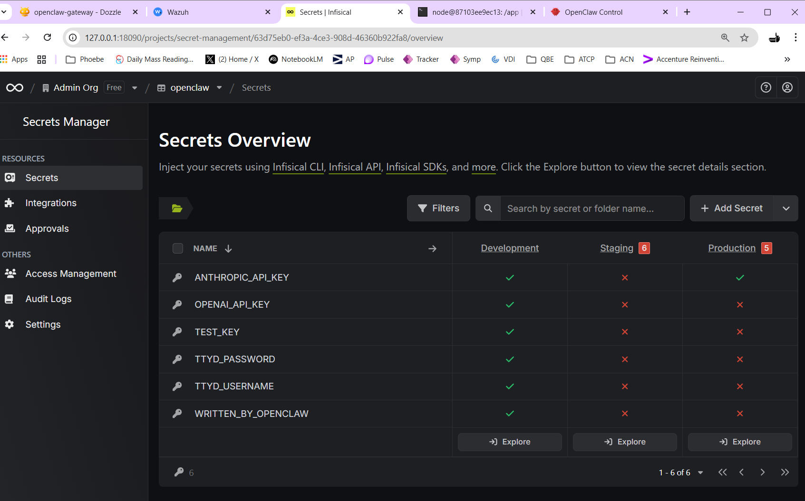
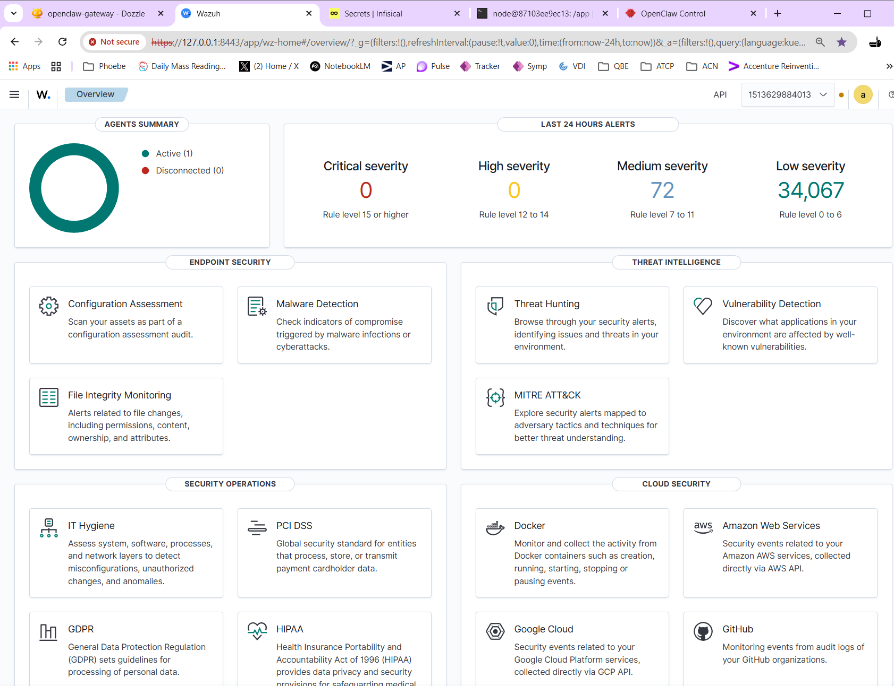

# IronNest

**The secure local platform for running AI workloads on Windows.**

IronNest gives you a production-grade security envelope for running [OpenClaw](https://github.com/openclaw/openclaw) — a self-hosted AI gateway — on your Windows 11 machine. It bundles seven independent security layers around the AI workload so that your API keys, outbound traffic, host OS, and container runtime are all protected, monitored, and auditable, without needing cloud infrastructure.

```
Socket Isolation → Observability → DNS Filtering → Egress Control → SIEM → Image Scanning → Secrets → AI Core
```

---

## Platform in action

**OpenClaw — AI gateway overview**


**Dozzle — real-time logs across all 14 containers**


**OpenClaw browser terminal — run CLI commands from your browser**


**AdGuard Home — DNS filtering dashboard**


**Infisical — self-hosted secrets vault**


**Wazuh — SIEM dashboard monitoring host and containers**


---

## What is OpenClaw and why does it need a security platform?

[OpenClaw](https://github.com/openclaw/openclaw) is a self-hosted AI gateway that lets you run conversations with Anthropic Claude, OpenAI GPT, and other AI providers through a single local interface. Think of it as a private, self-contained AI assistant that you fully control.

Running OpenClaw locally sounds simple — pull a Docker image, set an API key, done. But that surface is deceptively dangerous:

- **Your API keys are your billing and data liability.** A leaked `ANTHROPIC_API_KEY` or `OPENAI_API_KEY` means someone else charges to your account and reads your conversation history.
- **AI containers make real outbound connections.** Without controls, a compromised or misbehaving container can exfiltrate data to arbitrary destinations.
- **Your Windows host is part of the attack surface.** The container engine, shared volumes, and host networking all represent potential paths from a container to your machine.
- **Secrets in `.env` files get committed.** It happens constantly — developers paste API keys into compose files, commit them, and push to GitHub.

IronNest solves all of this. It treats OpenClaw as a zero-trust workload: it gets exactly the access it needs to do its job (reach AI provider APIs, read injected secrets) and nothing more.

> OpenClaw is the default AI workload, but the platform is workload-agnostic. Swap out the `openclaw/` stack for any containerized AI application and the surrounding seven security layers remain unchanged.

---

## How the security layers work together

Each layer is an independent Docker Compose project. They defend the platform in sequence — if one fails or is misconfigured, the others continue to function independently.

### 1. Socket Proxy — `security/socket-proxy/`
The Docker socket (`/var/run/docker.sock`) is the most dangerous file on a Linux host. Any container that mounts it can control every other container, read all environment variables, and escape to the host.

IronNest never mounts the raw socket anywhere. Instead, a **Tecnativa socket proxy** exposes a read-only subset of the Docker API (container list, events, image list, network list) over TCP. Dozzle, Wazuh, and Trivy connect through this proxy. Write operations, exec, and build endpoints are blocked entirely.

### 2. Observability — `observability/dozzle/`
**Dozzle** provides a real-time browser-based log viewer for all containers. It connects to the socket proxy (never the raw socket) and streams logs from every running container at `http://127.0.0.1:8888`. This is your primary window into what OpenClaw is doing at any given moment.

### 3. DNS Filtering — `security/adguard/`
Every container in IronNest has its DNS server hard-coded to `172.30.0.10` — the AdGuard Home container. This means no container can bypass DNS-layer blocking by using an alternative resolver.

AdGuard blocks known malicious domains, ad networks, and tracking endpoints before any TCP connection is even attempted. If OpenClaw or any dependency tries to resolve a blocked domain, the query is dropped at the DNS level.

### 4. Egress Control — `security/egress-proxy/`
All outbound HTTP and HTTPS traffic is routed through **Squid**, a forward proxy with a strict hostname allowlist. OpenClaw is configured with `HTTP_PROXY=http://squid:3128` — it cannot make a direct internet connection.

The allowlist for OpenClaw permits only:
- `.anthropic.com` — Claude API
- `.openai.com`, `.chatgpt.com` — OpenAI / Codex
- Other explicitly named AI provider endpoints

Any destination not on the allowlist is denied with a `403 Forbidden`. On top of this, `openclaw/start.sh` inserts a `DOCKER-USER` firewall rule at the kernel level that drops any NEW outbound TCP connection that tries to bypass the proxy entirely (`curl --noproxy`-style). The proxy is not optional — it is enforced at two layers.

### 5. SIEM — `security/wazuh/`
**Wazuh** is an open-source Security Information and Event Management system. IronNest runs a full Wazuh stack: manager, OpenSearch indexer, and dashboard. A Windows host agent is installed on the PC itself (not just inside containers), so Wazuh monitors:

- File integrity on the Windows host
- Process creation and termination
- Container events via the socket proxy
- Login attempts and privilege escalation
- Network anomalies

The Wazuh dashboard is accessible at `https://127.0.0.1:8443` and provides real-time alerts and historical event queries.

### 6. Image Scanner — `security/trivy/`
**Trivy** runs as a persistent CVE database server at port 4954. When you want to audit your container images for known vulnerabilities, run:

```bash
./security/trivy/scan.sh all
```

Trivy checks every running image against its CVE database and produces a report. This catches upstream vulnerabilities in base images before they become exploitable.

### 7. Secrets Manager — `secrets/`
**Infisical** is a self-hosted secrets management platform (think HashiCorp Vault, but simpler). IronNest uses it as the single source of truth for all sensitive values — AI API keys, gateway tokens, browser terminal credentials.

The `openclaw/` stack includes an **Infisical Agent sidecar** that authenticates to Infisical using a Machine Identity (not a user account), fetches secrets, and writes them to a runtime `.env` file every 60 seconds. OpenClaw reads this file at startup. Your API keys never appear in `docker-compose.yml`, never in a `.env` committed to git, never in the container image.

### AI Core — `openclaw/`
OpenClaw runs inside the `openclaw/` stack with strict isolation:

- No Docker socket access
- No capability to start, stop, or inspect other containers
- All outbound traffic forced through Squid
- All secrets injected at runtime by the Infisical agent sidecar
- `cap_drop: ALL` and `no-new-privileges: true`
- A browser terminal (`ttyd`) at `http://127.0.0.1:7681` for running CLI commands like `openclaw security audit` directly from your browser

---

## System Requirements

IronNest runs 14 containers simultaneously. Wazuh's OpenSearch indexer is the most memory-intensive component — plan your hardware accordingly before starting.

| Component | Minimum | Recommended |
|---|---|---|
| **OS** | Windows 11 (22H2+) | Windows 11 (latest updates) |
| **RAM** | 16 GB | 32 GB |
| **CPU** | 4 cores / 8 threads | 8+ cores |
| **System drive (C:)** | 60 GB free | 100 GB free |
| **Docker storage** | 40 GB free (separate drive strongly recommended) | 100 GB free |
| **Backup target** | 50 GB free | 100 GB free |
| **Virtualization** | Hyper-V or VT-x/AMD-V enabled in BIOS | — |

**Why a separate drive for Docker storage?** Rancher Desktop stores all container images, volumes, and the WSL2 VHD on a single `.vhdx` file. This file grows significantly over time (Wazuh images alone are ~3 GB). Keeping it on a drive separate from your Windows system drive prevents Docker growth from impacting OS performance.

**Container memory budget (enforced limits):**

| Stack | Containers | Memory limit |
|---|---|---|
| Wazuh (manager + indexer + dashboard) | 3 | 5.0 GB |
| OpenClaw gateway + ttyd | 2 | 4.1 GB |
| Infisical + Postgres + Redis | 3 | 1.8 GB |
| Trivy, Squid, AdGuard, Dozzle, socket-proxy | 5 | 1.2 GB |
| **Total** | **14** | **~12.1 GB** |

> Windows itself plus WSL2 overhead adds ~2–4 GB on top. On a 16 GB machine, if you experience memory pressure, reduce Wazuh's indexer heap: add `OPENSEARCH_JAVA_OPTS=-Xms512m -Xmx1g` to `security/wazuh/.env`.

**Storage breakdown:**
- Container images: ~8 GB on first pull (Wazuh images are large)
- Wazuh indexer data: grows with log volume — plan for 10–20 GB over time
- Trivy CVE database: ~1 GB (regenerable, not backed up)
- Backups: ~500 MB per daily snapshot × 14-day retention ≈ 7 GB minimum

---

## What's included

| Stack | Path | Purpose | Local UI |
|---|---|---|---|
| Socket proxy | `security/socket-proxy/` | Read-only Docker API for Dozzle / Wazuh / Trivy | — |
| DNS filter | `security/adguard/` | AdGuard Home — DNS-layer blocking for all containers | `127.0.0.1:3000` |
| Egress proxy | `security/egress-proxy/` | Squid — hostname-allowlisted HTTPS egress | — |
| SIEM | `security/wazuh/` | Wazuh manager + indexer + dashboard | `127.0.0.1:8443` |
| Image scanner | `security/trivy/` | CVE database server + on-demand scanner | — |
| Secrets manager | `secrets/` | Infisical + Postgres + Redis | `127.0.0.1:8090` |
| Log viewer | `observability/dozzle/` | Real-time container log viewer | `127.0.0.1:8888` |
| AI workload | `openclaw/` | OpenClaw gateway + ttyd browser terminal | `127.0.0.1:18789`, `127.0.0.1:7681` |

---

## Prerequisites

Install these before starting:

**1. Rancher Desktop**
Download from [rancherdesktop.io](https://rancherdesktop.io). During setup:
- Set the container runtime to **moby** (not containerd)
- Enable the WSL2 backend
- Allocate at least 12 GB RAM and 4 CPUs to the WSL2 VM in Rancher Desktop preferences

**2. Git for Windows**
Download from [git-scm.com](https://git-scm.com). This includes **Git Bash**, which is the shell used for all bash commands in this guide.

**3. PowerShell 7+**
Download from [github.com/PowerShell/PowerShell](https://github.com/PowerShell/PowerShell/releases). Required for the autostart task setup.

**4. GitHub CLI** (optional, for pushing releases)
```powershell
winget install GitHub.cli
```

---

## First-time setup

Follow these steps in order. Each step builds on the previous one.

---

### Step 1 — Clone the repository

Open Git Bash and run:

```bash
git clone https://github.com/Wild0live/ironnest.git
cd ironnest
```

---

### Step 2 — Add Rancher Desktop binaries to PATH

Rancher Desktop installs `docker`, `docker compose`, and related tools inside the WSL2 VM. To use them from Git Bash on Windows, add them to your PATH:

```bash
export PATH="/c/Program Files/Rancher Desktop/resources/resources/win32/bin:$PATH"
```

To make this permanent, add the line to `~/.bashrc`:

```bash
echo 'export PATH="/c/Program Files/Rancher Desktop/resources/resources/win32/bin:$PATH"' >> ~/.bashrc
source ~/.bashrc
```

Verify it works:

```bash
docker info
```

You should see output describing the Docker engine. If you see an error, make sure Rancher Desktop is running (check the system tray icon).

---

### Step 3 — Configure secrets for each stack

Every stack reads its configuration from a `.env` file. These files are gitignored — you create them from the `.env.example` templates provided.

**Copy the templates:**

```bash
cp secrets/.env.example          secrets/.env
cp security/wazuh/.env.example   security/wazuh/.env
cp openclaw/.env.example         openclaw/.env
```

**Edit `secrets/.env`** — this configures Infisical and its database:

```bash
# Generate a secure random value for each secret field:
openssl rand -hex 32
```

Run that command four times to get four unique values. Fill them in:

| Variable | What to set |
|---|---|
| `POSTGRES_PASSWORD` | A random 32-byte hex string |
| `REDIS_PASSWORD` | A different random 32-byte hex string |
| `ENCRYPTION_KEY` | A random 32-byte hex string (exactly 32 bytes — 64 hex chars) |
| `AUTH_SECRET` | A random 32-byte hex string |
| `DB_CONNECTION_URI` | Paste `POSTGRES_PASSWORD` into the template: `postgresql://infisical:<password>@postgres:5432/infisical` |
| `REDIS_URL` | Paste `REDIS_PASSWORD` into the template: `redis://:<password>@redis:6379` |
| `SMTP_*` | Optional — needed only for Infisical email invites. Use a Gmail App Password (`myaccount.google.com/apppasswords`) |

**Edit `security/wazuh/.env`** — set three passwords for the Wazuh components:

| Variable | What to set |
|---|---|
| `WAZUH_INDEXER_PASSWORD` | A strong password (16+ chars, mixed case, symbols) |
| `WAZUH_API_PASSWORD` | A different strong password |
| `WAZUH_DASHBOARD_PASSWORD` | A different strong password |

> Keep these passwords consistent — Wazuh's components authenticate to each other using them.

**Edit `openclaw/.env`** — this is filled in two stages. For now, set only:

| Variable | What to set |
|---|---|
| `OPENCLAW_GATEWAY_TOKEN` | Any random string (e.g. output of `openssl rand -hex 32`) |
| `OPENCLAW_IMAGE` | Leave as default (`ghcr.io/openclaw/openclaw:latest`) or pin a specific version |

You will fill in `INFISICAL_*` values in Step 6 after Infisical is running.

---

### Step 4 — Generate Wazuh TLS certificates

Wazuh's manager, indexer, and dashboard communicate over mutual TLS. You need to generate certificates before the stack can start. IronNest includes a generator compose file for this:

```bash
cd security/wazuh
docker compose -f generate-indexer-certs.yml run --rm generator
cd ../..
```

This creates `security/wazuh/config/wazuh_indexer_ssl_certs/` containing the CA, node, admin, and dashboard certificates. This directory is gitignored — you must regenerate certificates on each fresh clone.

---

### Step 5 — Bootstrap the platform

Run bootstrap to create the shared networks and start all always-on stacks:

```bash
bash bootstrap.sh
```

Bootstrap does the following in order:
1. Creates `platform-net` (internal network — no internet, inter-service communication only)
2. Creates `platform-egress` (internet-capable — for services that need raw TCP like SMTP and Wazuh threat feeds)
3. Starts stacks in dependency order: `socket-proxy → adguard → egress-proxy → secrets → dozzle → wazuh → trivy`
4. Fixes Rancher Desktop's DNAT rules that would otherwise break intra-container TCP communication

The first bootstrap takes several minutes — Wazuh images are large and the indexer takes time to initialize. Watch progress with:

```bash
docker compose -p wazuh logs -f
```

When all containers show healthy, move to the next step.

---

### Step 6 — Set up Infisical and configure OpenClaw secrets

Infisical is your self-hosted secrets vault. You need to complete its first-run setup before OpenClaw can start.

**Open Infisical:**

Navigate to `http://127.0.0.1:8090` in your browser. Complete the sign-up form to create your admin account.

**Create a project:**

1. Click **New Project** → name it `openclaw` (or anything you prefer)
2. Go into the project → select the **Development** environment
3. Click **Add Secret** and add the following secrets at the root path `/`:

| Secret name | Value |
|---|---|
| `ANTHROPIC_API_KEY` | Your Anthropic API key (`sk-ant-...`) |
| `OPENAI_API_KEY` | Your OpenAI API key (optional) |
| `TTYD_USERNAME` | A username for the browser terminal login |
| `TTYD_PASSWORD` | A strong password for the browser terminal |

**Create a Machine Identity for OpenClaw:**

The Infisical Agent sidecar authenticates to Infisical using a Machine Identity (a non-human credential, similar to a service account). This prevents needing to store your personal Infisical password in the compose config.

1. In Infisical, go to **Access Control → Machine Identities**
2. Click **Create Identity** → name it `openclaw-gateway`
3. Set the role to **Member** (read access to secrets)
4. Click **Create**
5. On the identity page, click **Create Client Secret** → copy both the **Client ID** and **Client Secret**

**Update `openclaw/.env`** with the Machine Identity credentials:

```
INFISICAL_UNIVERSAL_AUTH_CLIENT_ID=<paste Client ID here>
INFISICAL_UNIVERSAL_AUTH_CLIENT_SECRET=<paste Client Secret here>
INFISICAL_CLIENT_ID=<same Client ID>
INFISICAL_CLIENT_SECRET=<same Client Secret>
```

**Update the secrets template with your project ID:**

Your Infisical project has a UUID visible in the browser URL when you're inside the project (e.g. `http://127.0.0.1:8090/project/63d75eb0-ef3a-4ce3-908d-46360b922fa8/...`). Copy that UUID and replace the placeholder in:

```
openclaw/agent-config/secrets.tmpl
```

Change:
```
{{- range secret "<YOUR_INFISICAL_PROJECT_ID>" "dev" "/" }}
```
To:
```
{{- range secret "your-actual-uuid-here" "dev" "/" }}
```

---

### Step 7 — Start OpenClaw

OpenClaw is intentionally not started by `bootstrap.sh` — it is the AI workload and you control when it runs. Start it with:

```bash
bash openclaw/start.sh
```

`start.sh` does more than a bare `docker compose up -d`:
- Repairs DNAT rules specific to the OpenClaw network
- Starts all OpenClaw containers (gateway, Infisical agent sidecar, ttyd terminal)
- Waits for the gateway to become healthy
- Registers AI provider API keys from Infisical into the gateway
- Verifies that direct internet bypass is blocked

**Access OpenClaw:**

| Interface | URL | Notes |
|---|---|---|
| OpenClaw UI | `http://127.0.0.1:18789` | Main AI gateway interface |
| Browser terminal | `http://127.0.0.1:7681` | Login with `TTYD_USERNAME` / `TTYD_PASSWORD` |
| Dozzle logs | `http://127.0.0.1:8888` | All container logs in real time |
| Infisical | `http://127.0.0.1:8090` | Secrets management |
| AdGuard | `http://127.0.0.1:3000` | DNS filter dashboard |
| Wazuh | `https://127.0.0.1:8443` | SIEM dashboard |

**Run a security audit from the browser terminal:**

Open `http://127.0.0.1:7681`, log in, then:

```bash
openclaw security audit
openclaw security audit --deep
openclaw security audit --fix
```

---

### Step 8 — (Recommended) Set up autostart

Rancher Desktop injects DNAT rules on every boot that break intra-container TCP communication. Without the autostart task, you need to run `bootstrap.sh` manually after every login.

The autostart task runs `bootstrap.sh` and then `openclaw/start.sh` automatically after Rancher Desktop finishes initializing. It polls `docker info` for up to 3 minutes so it handles slow boots gracefully.

Run this in an **elevated PowerShell terminal** (right-click PowerShell → Run as Administrator):

```powershell
$action  = New-ScheduledTaskAction `
    -Execute "pwsh.exe" `
    -Argument "-NonInteractive -WindowStyle Hidden -File `"D:\ironnest\ops\autostart.ps1`""
$trigger  = New-ScheduledTaskTrigger -AtLogOn -User $env:USERNAME
$settings = New-ScheduledTaskSettingsSet `
    -ExecutionTimeLimit (New-TimeSpan -Minutes 5) `
    -StartWhenAvailable $true
Register-ScheduledTask `
    -TaskName "platform-autostart" `
    -Action $action `
    -Trigger $trigger `
    -Settings $settings `
    -RunLevel Highest `
    -Force
```

> Update the path in `-Argument` to match wherever you cloned the repo.

Test it immediately without logging out:

```powershell
Start-ScheduledTask -TaskName "platform-autostart"
```

---

### Step 9 — (Optional) Install the Wazuh Windows host agent

Wazuh can monitor the Windows host OS (not just containers) for file integrity changes, suspicious processes, and login anomalies. Installing the Windows agent connects your host to the Wazuh manager running in the container.

1. Download the Windows agent MSI from `https://packages.wazuh.com/4.x/windows/wazuh-agent-4.x.x-1.msi`
2. Install it — accept defaults
3. Enroll the agent against the local Wazuh manager:

```powershell
& "C:\Program Files (x86)\ossec-agent\agent-auth.exe" -m 127.0.0.1 -p 1515
Restart-Service WazuhSvc
```

The agent appears in the Wazuh dashboard at `https://127.0.0.1:8443` within a minute.

> If you restart the Wazuh manager container, `client.keys` on the host goes stale. Remove the old agent from the manager (`manage_agents -r <id>`) then re-run the enrollment command.

---

## Day-to-day operations

```bash
# Check status of all stacks
./ops/status.sh

# View live logs for all containers
# → open http://127.0.0.1:8888 in your browser

# Run a CVE scan across all running images
./security/trivy/scan.sh all

# Restart a single stack without touching others
cd secrets && docker compose restart

# Stop OpenClaw when not in use (security and resource good practice)
cd openclaw && docker compose stop

# Start OpenClaw again
bash openclaw/start.sh

# Run an OpenClaw security audit (from browser terminal at http://127.0.0.1:7681)
openclaw security audit
openclaw security audit --fix
```

---

## After every Rancher Desktop restart

If autostart (Step 8) is configured, this is handled automatically. If not:

```bash
bash bootstrap.sh       # fixes DNAT rules, starts always-on stacks
bash openclaw/start.sh  # starts OpenClaw
```

Never use bare `docker compose up -d` to start stacks after a restart — the DNAT fix must run first or intra-container TCP will silently fail.

---

## Backup and restore

IronNest includes a backup script that snapshots all persistent volumes to a directory of your choice:

```bash
# Edit ops/backup.sh to set your backup destination path, then:
bash ops/backup.sh
```

Each backup run produces a timestamped directory containing:
- `postgres.sql.gz` — Infisical database
- `openclaw-home.tar.gz` — OpenClaw persistent state (auth profiles, config)
- `adguard-conf.tar.gz` — AdGuard filter lists and settings
- `wazuh-*.tar.gz` — Wazuh manager config, logs, and indexer data
- `platform-config.tar.gz` — all `.env` files, TLS certs, compose files
- `SHA256SUMS` — checksums for all artifacts

Retention is 14 days by default (configurable in `ops/backup.sh`).

**To restore from a backup:**

```bash
bash ops/restore.sh /path/to/backup/<timestamp>
```

Restore verifies checksums before touching anything, tears down all stacks, restores volumes, then runs `bootstrap.sh` automatically.

---

## Troubleshooting

**Containers can connect via ping but not TCP**

This is the Rancher Desktop DNAT hijack. Run:

```bash
bash ops/fix-nat-prerouting.sh
```

Or just re-run `bootstrap.sh`.

**Infisical agent shows `i/o timeout` connecting to Infisical**

Same root cause as above. Run the fix above, then:

```bash
cd openclaw && docker compose restart infisical-agent
```

**OpenClaw browser terminal (`http://127.0.0.1:7681`) asks for credentials but rejects them**

The `TTYD_USERNAME` and `TTYD_PASSWORD` secrets may not have synced yet from Infisical. Check:

```bash
docker exec openclaw-infisical-agent cat /secrets/.env | grep TTYD
```

If empty, restart the agent:

```bash
docker restart openclaw-infisical-agent
```

Wait 15 seconds, then restart ttyd:

```bash
cd openclaw && docker compose restart openclaw-ttyd
```

**Wazuh dashboard shows no agents**

The host agent's `client.keys` is stale after a Wazuh manager restart. Re-enroll:

```powershell
& "C:\Program Files (x86)\ossec-agent\agent-auth.exe" -m 127.0.0.1 -p 1515
Restart-Service WazuhSvc
```

**A container is unhealthy after bootstrap**

Check its logs:

```bash
docker compose -p <stack-name> logs <service-name>
```

Or view it in Dozzle at `http://127.0.0.1:8888`. Most issues after a fresh bootstrap are Wazuh indexer startup time — give it 2–3 minutes.

---

## Design principles

- **Zero raw socket access.** The Docker socket is never mounted. All consumers use a read-only proxy.
- **DNS is not optional.** Every container's DNS is hard-coded to AdGuard. No container can use an alternative resolver.
- **Egress is not optional.** All HTTP/HTTPS goes through Squid. Direct internet access from OpenClaw is also blocked at the kernel level — two independent layers.
- **Secrets never touch git.** API keys live in Infisical and are injected at runtime. `.env` files are gitignored. `.env.example` templates show structure without values.
- **Blast-radius isolation.** Each capability is its own Compose project. A crashing Wazuh stack cannot take down OpenClaw or Infisical.
- **Everything has a resource limit.** No container can starve the WSL2 VM by consuming unbounded memory or CPU.
- **All images are pinned.** No `latest` or floating tags. Upgrades are explicit, auditable, and intentional.

---

## License

MIT
