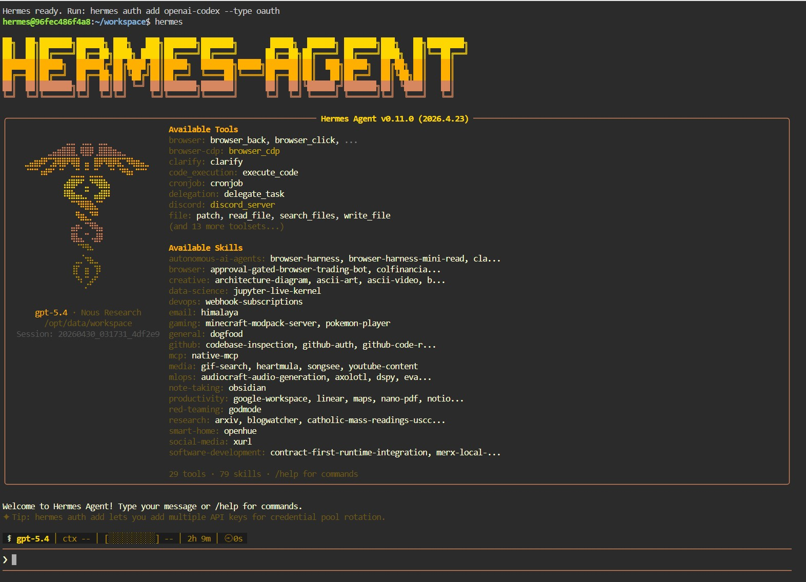
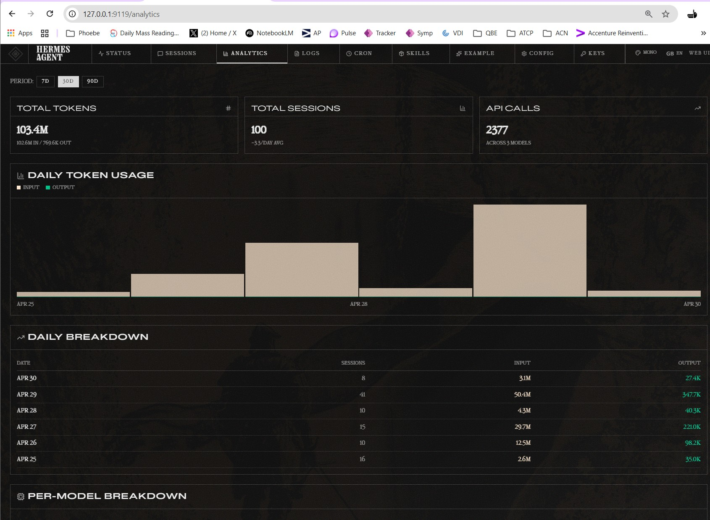

# IronNest

**The secure local platform for running AI workloads on Windows.**

IronNest gives you a production-grade security envelope for running AI workloads — [OpenClaw](https://github.com/openclaw/openclaw) (self-hosted AI gateway) and [Hermes Agent](https://github.com/NousResearch/hermes-agent) (autonomous AI agent with Telegram gateway, run here as the multi-profile **Hermes Platform** stack) — on your Windows 11 machine. It wraps every workload in ten independent security layers so that your API keys, outbound traffic, host OS, and container runtime are all protected, monitored, and auditable, without needing cloud infrastructure.

```
FIDO Identity Gate (Authelia) → Socket Isolation → DNS Filtering → Egress Control
  → Secrets → Ingress/TLS → SIEM → Image Scanning → Observability → AI Workloads
```

Every admin UI (Infisical, Dozzle, AdGuard, OpenClaw, Hermes, Wazuh, Traefik dashboard) is reachable only via `https://*.ironnest.local/` and requires a **physical FIDO key tap** (WebAuthn passkey) to establish a session — most through Authelia's ForwardAuth middleware, and Wazuh through OIDC SSO against Authelia (since 2026-05-28). Backend services don't publish loopback ports, so an attacker who took remote control of the Windows host can't reach any UI without producing the security key.

---

## Platform in action

**OpenClaw — AI gateway overview**


**Dozzle — real-time logs across all containers**


**OpenClaw browser terminal — run CLI commands from your browser**


**AdGuard Home — DNS filtering dashboard**


**Infisical — self-hosted secrets vault**


**Wazuh — SIEM dashboard monitoring host and containers**


**Hermes Agent — autonomous AI agent TUI with tools and skills**


**Hermes Agent — analytics dashboard (95.2M tokens, 93 sessions)**


---

## What is OpenClaw and why does it need a security platform?

[OpenClaw](https://github.com/openclaw/openclaw) is a self-hosted AI gateway that lets you run conversations with Anthropic Claude, OpenAI GPT, Google Gemini, and other AI providers through a single local interface. Think of it as a private, self-contained AI assistant that you fully control.

Running OpenClaw locally sounds simple — pull a Docker image, set an API key, done. But that surface is deceptively dangerous:

- **Your API keys are your billing and data liability.** A leaked `ANTHROPIC_API_KEY` or `OPENAI_API_KEY` means someone else charges to your account and reads your conversation history.
- **AI containers make real outbound connections.** Without controls, a compromised or misbehaving container can exfiltrate data to arbitrary destinations.
- **Your Windows host is part of the attack surface.** The container engine, shared volumes, and host networking all represent potential paths from a container to your machine.
- **Secrets in `.env` files get committed.** It happens constantly — developers paste API keys into compose files, commit them, and push to GitHub.

IronNest solves all of this. It treats every AI workload as a zero-trust tenant: each one gets exactly the access it needs to do its job (reach AI provider APIs, read injected secrets) and nothing more.

> IronNest currently ships two AI workloads — OpenClaw (AI gateway) and Hermes Agent (autonomous agent + Telegram gateway). The surrounding security layers are workload-agnostic: swap either stack for any containerised AI application and the perimeter remains unchanged.

---

## How the security layers work together

Each layer is an independent Docker Compose project. They defend the platform in sequence — if one fails or is misconfigured, the others continue to function independently.

### 0. Identity Gate (FIDO / WebAuthn) — `security/ingress/authelia/`

**Authelia** sits in front of every `*.ironnest.local` Traefik router as a ForwardAuth middleware. With `enable_passkey_login: true`, login is a single-factor passkey ceremony — a tap on a USB FIDO key (e.g. YubiKey) or a Windows Hello prompt. No password is needed for daily use; the bootstrap password is the fallback only if the security key is lost.

Once you've passed the FIDO gate, a session cookie covers all `.ironnest.local` subdomains (Dozzle, Infisical, AdGuard, OpenClaw, Hermes, Hermes-Dashboard, Traefik dashboard). The cookie is short-lived (1h inactivity, 4h max, no remember-me) so a stolen session has a small useful window.

The backend services no longer publish loopback ports — the only network path from the host to each UI runs through Traefik → Authelia. An attacker who has remote control of your Windows session cannot reach any IronNest UI without producing the physical key.

One intentional escape hatch remains:
- **Traefik dashboard** at `http://127.0.0.1:8880/dashboard/` — useful as a last-resort if Traefik's routing itself breaks.

The **Wazuh dashboard** used to be a carve-out (its SPA breaks behind ForwardAuth, so it ran on its own password login with a `https://127.0.0.1:8443` loopback hatch). As of **2026-05-28 it is fully FIDO-gated via OIDC SSO** against Authelia (the dashboard runs its own OpenID Connect flow, so the SPA never sees a 302-to-HTML). The `8443` loopback hatch is closed — Wazuh is reachable only at `https://wazuh.ironnest.local/`.

### 1. Socket Proxy — `security/socket-proxy/`
The Docker socket (`/var/run/docker.sock`) is the most dangerous file on a Linux host. Any container that mounts it can control every other container, read all environment variables, and escape to the host.

IronNest never mounts the raw socket anywhere. Instead, a **Tecnativa socket proxy** exposes a read-only subset of the Docker API (container list, events, image list, network list) over TCP. Dozzle, Wazuh, and Trivy connect through this proxy. Write operations, exec, and build endpoints are blocked entirely.

### 2. Observability — `observability/dozzle/`
**Dozzle** provides a real-time browser-based log viewer for all containers. It connects to the socket proxy (never the raw socket) and streams logs from every running container at `https://dozzle.ironnest.local/` (FIDO-gated via Authelia). This is your primary window into what OpenClaw is doing at any given moment.

### 3. DNS Filtering — `security/adguard/`
Every container in IronNest has its DNS server hard-coded to `172.30.0.10` — the AdGuard Home container. This means no container can bypass DNS-layer blocking by using an alternative resolver.

AdGuard blocks known malicious domains, ad networks, and tracking endpoints before any TCP connection is even attempted. If OpenClaw or any dependency tries to resolve a blocked domain, the query is dropped at the DNS level.

### 4. Egress Control — `security/egress-proxy/`
All outbound HTTP and HTTPS traffic is routed through **Squid**, a forward proxy. OpenClaw and Hermes are configured with `HTTP_PROXY=http://squid:3128` — they cannot make a direct internet connection.

Squid uses an **allow-by-default / blocklist** model: all destinations are permitted unless they appear on a live threat feed. A companion `blocklist-updater` container fetches **Spamhaus DROP/EDROP**, **Emerging Threats C2**, and **Feodo Tracker** every 6 hours and reloads Squid without a restart. This means known-malicious IPs and domains are blocked at the TCP level, while legitimate new AI provider endpoints work without manual config changes.

On top of this, the on-demand stacks' `start.sh` scripts insert a `DOCKER-USER` firewall rule at the kernel level that drops any NEW outbound TCP connection from their port-publishing ingress bridge that tries to bypass the proxy entirely (`curl --noproxy`-style). The proxy is not optional — it is enforced at two independent layers: Squid blocklist + kernel firewall.

### 5. SIEM — `security/wazuh/`
**Wazuh** is an open-source Security Information and Event Management system. IronNest runs a full Wazuh stack: manager, OpenSearch indexer, and dashboard. A Windows host agent is installed on the PC itself (not just inside containers), so Wazuh monitors:

- File integrity on the Windows host
- Process creation and termination
- Container events via the socket proxy
- Login attempts and privilege escalation
- Network anomalies

The Wazuh dashboard is accessible only at `https://wazuh.ironnest.local/` (the `https://127.0.0.1:8443/` loopback hatch was closed 2026-05-27). Login is **FIDO-gated via OIDC SSO** against Authelia: the dashboard runs its own OpenID Connect flow, you tap your passkey at `auth.ironnest.local`, and the dashboard establishes its own session — so the SPA never breaks the way it did under ForwardAuth (see the Identity Gate notes above and ARCHITECTURE.md). It provides real-time alerts and historical event queries.

### 6. Image Scanner — `security/trivy/`
**Trivy** runs as a persistent CVE database server at port 4954. When you want to audit your container images for known vulnerabilities, run:

```bash
./security/trivy/scan.sh all
```

Trivy checks every running image against its CVE database and produces a report. This catches upstream vulnerabilities in base images before they become exploitable.

### 7. Secrets Manager — `secrets/`
**Infisical** is a self-hosted secrets management platform (think HashiCorp Vault, but simpler). IronNest uses it as the single source of truth for all sensitive values — AI API keys, gateway tokens, browser terminal credentials.

Both `openclaw/` and `hermes/` stacks include an **Infisical Agent sidecar** that authenticates using a Machine Identity, fetches secrets, and writes them to a runtime `.env` file every 60 seconds. API keys never appear in `docker-compose.yml`, never in a `.env` committed to git, never in a container image.

**Per-workload scoping uses folders, not key prefixes.** When two workloads need the same logical secret (e.g. each `hermes-gateway-*` profile needs its own `TELEGRAM_BOT_TOKEN`), the right pattern is one Infisical folder per workload — `/steve`, `/qa`, `/mark` — each holding the workload's specific values plus a Secret Link importing shared keys from `/`. The workload sets `INFISICAL_PATH=/<name>` and `infisical run --include-imports` merges its folder with the imports. This isolates blast radius (a compromised gateway only sees its own folder + shared), keeps ACLs aligned with workload boundaries, and avoids the brittle naming-convention path (`STEVE_TELEGRAM_BOT_TOKEN`, `MARK_TELEGRAM_BOT_TOKEN`, …) that doesn't scale and can't be enforced by access control. See [hermes/docker-compose.yml](hermes/docker-compose.yml) for the canonical example.

### AI Workloads — `openclaw/` and `hermes-platform/`

Both workloads run with strict isolation — no Docker socket access, no capability to control other containers, all outbound traffic forced through Squid, secrets injected at runtime.

**OpenClaw** (`openclaw/`) — self-hosted AI gateway:
- Supports Anthropic Claude, OpenAI GPT, Google Gemini, Codex (ChatGPT subscription), and other providers
- Gateway UI at `https://openclaw.ironnest.local/` (FIDO-gated)
- Browser terminal (`ttyd`) is built but not currently published or routed (loopback closed 2026-05-27). Re-enable in `openclaw/docker-compose.yml` and add a Traefik route if you want browser-based CLI access.

**Hermes Platform** (`hermes-platform/`) — autonomous Hermes agent, multi-profile, with a 3-tier long-term-memory plane:
- **Eight isolated per-profile gateways** (`hermes-pf-default`, `-mark`, `-steve`, `-qa`, `-littlejohn`, `-jaime`, `-bigbert`, `-octo`), each mounting only its own Docker volume; profiles with a Telegram bot run their own long-poller (one per bot avoids `getUpdates` conflicts). The `qa` profile was renamed from `wifey` on 2026-06-14 (now QA/verification); `octo` (platform-ops) was added 2026-06-12.
- Management TUI at `https://hermes-platform.ironnest.local/` (FIDO-gated) and a Vite web dashboard at `https://hermes-platform-dashboard.ironnest.local/` (FIDO-gated) — both served by `hermes-platform-ttyd`, the only container that can see every profile
- **Memory plane:** profile agents reach a policy-enforcing `memory-gateway` (the sole path to the OpenViking long-term-memory backend, which embeds via a local Ollama model). Profile containers cannot reach OpenViking directly — every memory read/write is authenticated, policy-checked, and audited.
- **Mission Control** (`hermes-platform-mission-control`, `https://mission.ironnest.local/`) — a standalone least-privilege ops dashboard (holds no secrets; reads the registry + audit log read-only). It also lets you chat with any profile from the browser via a tiny in-container agent-chat bridge (per-profile, token-gated, no Docker socket), with token streaming and downloads of files the agent produces.
- This replaces the legacy single-stack `hermes/` project (TUI + flat Telegram gateways), which was **removed 2026-05-31**; `hermes/` now exists only as the build context for the shared `platform/hermes-agent` image. See [hermes-platform/README.md](hermes-platform/README.md) and `hermes-platform/docs/` for the full architecture.

---

## System Requirements

IronNest runs 18 containers in always-on mode (9 bootstrap stacks). Wazuh's OpenSearch indexer is the most memory-intensive component — plan your hardware accordingly before starting.

| Component | Minimum | Recommended |
|---|---|---|
| **OS** | Windows 11 (22H2+) | Windows 11 (latest updates) |
| **RAM** | 16 GB | 32 GB |
| **CPU** | 4 cores / 8 threads | 8+ cores |
| **System drive (C:)** | 60 GB free | 100 GB free |
| **Docker storage** | 40 GB free (separate drive strongly recommended) | 100 GB free |
| **Backup target** | 50 GB free | 100 GB free |
| **Virtualization** | Hyper-V or VT-x/AMD-V enabled in BIOS | — |

**Why a separate drive for Docker storage?** Rancher Desktop stores all container images, volumes, and the WSL2 VHD on a single `.vhdx` file. This file grows significantly over time (Wazuh images alone are ~3 GB). Keeping it on a drive separate from your Windows system drive prevents Docker growth from impacting OS performance.

**Container memory budget (enforced limits, from the live running config).** "Always-on" = the 9 stacks `bootstrap.sh` starts; the on-demand stacks are brought up by the logon autostart task.

| Stack | Containers | Memory limit |
|---|---|---|
| Wazuh (manager + indexer + dashboard + infisical-agent) | 4 | 5.06 GB |
| Infisical + Postgres + Redis | 3 | 1.8 GB |
| Ingress (Traefik + Authelia + infisical-agent) | 3 | 0.44 GB |
| Monitoring (Fluent Bit + container-sync) | 2 | 0.16 GB |
| Trivy + Squid + blocklist-updater + AdGuard + Dozzle + socket-proxy | 6 | 1.25 GB |
| **Always-on total** | **18** | **~8.7 GB** |
| OpenClaw (gateway + ttyd + Infisical agent) | 3 | 5.06 GB |
| Hermes Platform (7 `hermes-pf-*` gateways + ttyd + memory-gateway + OpenViking + Ollama + Infisical agent + Mission Control dashboard) | 13 | 10.4 GB |
| Browser Intent (MCP + worker + Infisical agent) | 3 | 2.31 GB |
| **All-running total (every on-demand stack up)** | **37** | **~26.5 GB** |

> The Wazuh and Ingress stacks each gained an `infisical-agent` sidecar for the OIDC rollout (the dashboard's OIDC client secret and Authelia's OIDC HMAC/JWKS), which is why Wazuh is now 4 containers and Ingress 3.
>
> Hermes Platform grew from 12 to 13 containers (~8.56 → ~10.4 GB) on 2026-06-07 when the **Mission Control** ops dashboard was added: a new ~128 MB container, plus the seven `hermes-pf-*` raised from 0.5 CPU/512 MB to 2.0 CPU/768 MB and Ollama from 2.0 to 5.0 CPU (CPU starvation was throttling warm dashboard-chat turns).
>
> The optional **LLM Wiki** companion (separate project at `D:\LLM Wiki`, routes `wiki.ironnest.local` / `chat.ironnest.local`) adds 5 more containers (~1.75 GB) when running. It is not part of the cloneable platform tree.
>
> Windows itself plus WSL2 overhead adds ~2–4 GB on top. On a 16 GB machine, if you experience memory pressure, reduce Wazuh's indexer heap: add `OPENSEARCH_JAVA_OPTS=-Xms512m -Xmx1g` to `security/wazuh/.env`.

**Storage breakdown:**
- Container images: ~8 GB on first pull (Wazuh images are large)
- Wazuh indexer data: grows with log volume — plan for 10–20 GB over time
- Trivy CVE database: ~1 GB (regenerable, not backed up)
- Backups: ~500 MB per daily snapshot × 14-day retention ≈ 7 GB minimum

---

## What's included

All operator UIs are reached via `https://*.ironnest.local/` URLs through Traefik, gated by Authelia/FIDO (Wazuh via OIDC SSO, the rest via ForwardAuth). Backend services do not publish loopback ports by default; only the Traefik dashboard keeps a loopback escape hatch (`http://127.0.0.1:8880/dashboard/`).

| Stack | Path | Startup | Purpose | URL |
|---|---|---|---|---|
| Socket proxy | `security/socket-proxy/` | bootstrap | Read-only Docker API for Dozzle / Wazuh / Trivy | — |
| DNS filter | `security/adguard/` | bootstrap | AdGuard Home — DNS-layer blocking for all containers | `https://adguard.ironnest.local/` (FIDO) |
| Egress proxy | `security/egress-proxy/` | bootstrap | Squid + blocklist-updater — allow-by-default with threat blocklists | — |
| SIEM | `security/wazuh/` | bootstrap | Wazuh manager + indexer + dashboard + infisical-agent | `https://wazuh.ironnest.local/` (FIDO-gated via OIDC SSO against Authelia; loopback `8443` closed) |
| Image scanner | `security/trivy/` | bootstrap | CVE database server + on-demand scanner | — |
| Ingress | `security/ingress/` | bootstrap | Traefik reverse proxy (TLS termination, single internet entry point) + Authelia identity gate | `https://auth.ironnest.local/` (login portal), `https://traefik.ironnest.local/dashboard/` (FIDO) + escape hatch `http://127.0.0.1:8880/dashboard/` |
| Secrets manager | `secrets/` | bootstrap | Infisical + Postgres + Redis | `https://infisical.ironnest.local/` (FIDO + Infisical login) |
| Log viewer | `observability/dozzle/` | bootstrap | Real-time container log viewer | `https://dozzle.ironnest.local/` (FIDO) |
| Log shipping | `monitoring/` | bootstrap | Fluent Bit — ships all container logs → Wazuh OpenSearch | — |
| AI workload | `openclaw/` | on-demand | OpenClaw gateway + ttyd browser terminal | `https://openclaw.ironnest.local/` (FIDO); ttyd not currently published |
| Hermes Platform | `hermes-platform/` | on-demand | Hermes agent — 7 isolated per-profile gateways + management ttyd + Vite dashboard + 3-tier memory plane (memory-gateway + OpenViking + Ollama) + Mission Control ops dashboard | `https://hermes-platform.ironnest.local/` (ttyd TUI, FIDO), `https://hermes-platform-dashboard.ironnest.local/` (web dashboard, FIDO), `https://mission.ironnest.local/` (Mission Control, FIDO) |
| Browser Intent | `browser-intent/` | on-demand | Local MCP facade for allowlisted browser login intents | `127.0.0.1:18901` (MCP endpoint, not browser-facing) |

> The legacy single-stack `hermes/` Compose project (TUI + Telegram gateways at `hermes.ironnest.local` / `hermes-dashboard.ironnest.local`) was **removed 2026-05-31**. `hermes-platform/` is now the sole agent stack; `hermes/` survives only as the build context for the shared `platform/hermes-agent` image. The optional **LLM Wiki** companion (`D:\LLM Wiki`, on-demand) adds `wiki.ironnest.local` and `chat.ironnest.local`, both FIDO-gated.

---

## Prerequisites

Install these before starting:

**1. Rancher Desktop**
Download from [rancherdesktop.io](https://rancherdesktop.io). During setup:
- Set the container runtime to **moby** (not containerd)
- Enable the WSL2 backend
- Allocate at least 12 GB RAM and 4 CPUs to the WSL2 VM in Rancher Desktop preferences

**2. Git for Windows**
Download from [git-scm.com](https://git-scm.com). This includes **Git Bash**, which is the shell used for all bash commands in this guide.

**3. PowerShell 7+**
Download from [github.com/PowerShell/PowerShell](https://github.com/PowerShell/PowerShell/releases). Required for the autostart task setup.

**4. GitHub CLI** (optional, for pushing releases)
```powershell
winget install GitHub.cli
```

---

## First-time setup

Follow these steps in order. Each step builds on the previous one.

---

### Step 1 — Clone the repository

Open Git Bash and run:

```bash
git clone https://github.com/Wild0live/ironnest.git
cd ironnest
```

---

### Step 2 — Add Rancher Desktop binaries to PATH

Rancher Desktop installs `docker`, `docker compose`, and related tools inside the WSL2 VM. To use them from Git Bash on Windows, add them to your PATH:

```bash
export PATH="/c/Program Files/Rancher Desktop/resources/resources/win32/bin:$PATH"
```

To make this permanent, add the line to `~/.bashrc`:

```bash
echo 'export PATH="/c/Program Files/Rancher Desktop/resources/resources/win32/bin:$PATH"' >> ~/.bashrc
source ~/.bashrc
```

Verify it works:

```bash
docker info
```

You should see output describing the Docker engine. If you see an error, make sure Rancher Desktop is running (check the system tray icon).

---

### Step 3 — Configure secrets for each stack

Every stack reads its configuration from a `.env` file. These files are gitignored — you create them from the `.env.example` templates provided.

**Copy the templates:**

```bash
cp secrets/.env.example          secrets/.env
cp security/wazuh/.env.example   security/wazuh/.env
cp openclaw/.env.example         openclaw/.env
```

**Edit `secrets/.env`** — this configures Infisical and its database:

```bash
# Generate a secure random value for each secret field:
openssl rand -hex 32
```

Run that command four times to get four unique values. Fill them in:

| Variable | What to set |
|---|---|
| `POSTGRES_PASSWORD` | A random 32-byte hex string |
| `REDIS_PASSWORD` | A different random 32-byte hex string |
| `ENCRYPTION_KEY` | A random 32-byte hex string (exactly 32 bytes — 64 hex chars) |
| `AUTH_SECRET` | A random 32-byte hex string |
| `DB_CONNECTION_URI` | Paste `POSTGRES_PASSWORD` into the template: `postgresql://infisical:<password>@postgres:5432/infisical` |
| `REDIS_URL` | Paste `REDIS_PASSWORD` into the template: `redis://:<password>@redis:6379` |
| `SMTP_*` | Optional — needed only for Infisical email invites. Use a Gmail App Password (`myaccount.google.com/apppasswords`) |

**Edit `security/wazuh/.env`** — set three passwords for the Wazuh components:

| Variable | What to set |
|---|---|
| `WAZUH_INDEXER_PASSWORD` | A strong password (16+ chars, mixed case, symbols) |
| `WAZUH_API_PASSWORD` | A different strong password |
| `WAZUH_DASHBOARD_PASSWORD` | A different strong password |

> Keep these passwords consistent — Wazuh's components authenticate to each other using them.

**Edit `openclaw/.env`** — this is filled in two stages. For now, set only:

| Variable | What to set |
|---|---|
| `OPENCLAW_GATEWAY_TOKEN` | Any random string (e.g. output of `openssl rand -hex 32`) |
| `OPENCLAW_IMAGE` | Leave as default (`ghcr.io/openclaw/openclaw:latest`) or pin a specific version |

You will fill in `INFISICAL_*` values in Step 6 after Infisical is running.

---

### Step 4 — Generate Wazuh TLS certificates

Wazuh's manager, indexer, and dashboard communicate over mutual TLS. You need to generate certificates before the stack can start. IronNest includes a generator compose file for this:

```bash
cd security/wazuh
docker compose -f generate-indexer-certs.yml run --rm generator
cd ../..
```

This creates `security/wazuh/config/wazuh_indexer_ssl_certs/` containing the CA, node, admin, and dashboard certificates. This directory is gitignored — you must regenerate certificates on each fresh clone.

---

### Step 5 — Bootstrap the platform

First, run the pre-flight checker to catch common problems before they cause confusing errors mid-bootstrap:

```bash
bash ops/check-prereqs.sh
```

All checks should show `[PASS]`. Fix any `[FAIL]` items before continuing.

Then run bootstrap to create the shared networks and start all always-on stacks:

```bash
bash bootstrap.sh
```

Bootstrap does the following in order:
1. Creates `platform-net` (internal network — no internet, inter-service communication only)
2. Creates `platform-egress` (internet-capable — for services that need raw TCP like SMTP and Wazuh threat feeds)
3. Starts stacks in dependency order: `socket-proxy → adguard → egress-proxy → secrets → dozzle → wazuh → trivy`
4. Fixes Rancher Desktop's DNAT rules that would otherwise break intra-container TCP communication

The first bootstrap takes several minutes — Wazuh images are large and the indexer takes time to initialize. Watch progress with:

```bash
docker compose -p wazuh logs -f
```

When all containers show healthy, move to the next step.

---

### Step 5b — Set up the Authelia identity gate

Every `*.ironnest.local` UI is gated by Authelia ForwardAuth — a passkey (FIDO key or Windows Hello) is required to obtain a session cookie. Before you can reach any backend through Traefik, three things need to happen on the Windows host: the hostnames must resolve to `127.0.0.1`, Chrome must trust the self-signed Traefik cert (WebAuthn refuses to register a credential on any site with TLS errors), and you must register a passkey against your Authelia user.

**1. Add hosts file entries** (run in an **elevated PowerShell** prompt):

```powershell
$entries = @(
  'auth', 'dozzle', 'adguard', 'infisical', 'wazuh',
  'openclaw', 'hermes', 'hermes-dashboard',
  'hermes-platform', 'hermes-platform-dashboard', 'mission',
  'wiki', 'chat', 'traefik'
) | ForEach-Object { "127.0.0.1`t$_.ironnest.local" }
Add-Content -Path 'C:\Windows\System32\drivers\etc\hosts' -Value $entries
```

Verify with `Resolve-DnsName auth.ironnest.local` — it should return `127.0.0.1`.

**2. Trust the Traefik self-signed cert in the Windows certificate store.** Traefik mints its own cert into the `ingress_traefik-certs` volume. Extract it to a host file (using `[System.IO.File]::WriteAllText` to keep the LF newlines PEM expects), then import it into `LocalMachine\Root`:

```powershell
# Extract the cert from the Docker volume
$pem = docker run --rm -v ingress_traefik-certs:/certs alpine cat /certs/server.crt
[System.IO.File]::WriteAllText("$env:TEMP\ironnest-traefik.crt", ($pem -join "`n"))

# Import (requires elevated PowerShell)
Import-Certificate -FilePath "$env:TEMP\ironnest-traefik.crt" -CertStoreLocation Cert:\LocalMachine\Root
```

> This is **required** for WebAuthn. Chrome refuses `navigator.credentials.create()` on any origin with TLS errors, so passkey registration will silently fail until the cert is trusted. Restart Chrome after the import to pick up the new root.

**3. Register your passkey.**

1. Visit `https://auth.ironnest.local/` in a regular (non-incognito) Chrome window.
2. Log in with username `phoenix` (or whichever username you added in `security/ingress/authelia/users.yml`) and the bootstrap password from `security/ingress/authelia/secrets/bootstrap-password.txt`.
3. Navigate to **Settings → Two-Factor Authentication → WebAuthn Credentials → Add**.
4. Authelia emails an OTP through the filesystem notifier (no SMTP wired up). Retrieve it from the container:

   ```bash
   docker exec authelia tail /data/notifications.txt
   ```

   Paste the OTP into the dialog.
5. Tap your FIDO key (or trigger Windows Hello). The credential is stored in the SQLite DB at `/data/db.sqlite3` inside the `ingress_authelia-data` volume.

> **Incognito blocks WebAuthn *registration*.** Use a regular Chrome window for the enrollment ceremony; subsequent logins work fine in incognito. The bootstrap password remains valid as a fallback — keep it in a password manager in case you lose the security key.

> **ttyd and `Authorization: Basic`.** A backend that issues its own HTTP Basic challenge (as ttyd does) collides with Authelia consuming the same header for its session. So **both** OpenClaw's and Hermes Platform's ttyd run with Basic Auth **unset** — Authelia would try to validate the Basic creds against its passkey-only user store and 401 the request, so stacking Basic Auth actively breaks access. Authelia FIDO is the sole gate, and it's strictly stronger than Basic Auth.

Once registration succeeds, the session cookie covers every `.ironnest.local` subdomain for 1 h of inactivity (4 h max).

---

### Step 6 — Set up Infisical and configure OpenClaw secrets

Infisical is your self-hosted secrets vault. You need to complete its first-run setup before OpenClaw can start.

**Open Infisical:**

Navigate to `https://infisical.ironnest.local/` in your browser (you must finish Step 5b first — the loopback port `127.0.0.1:18090` is no longer published). Authelia will prompt for a passkey tap; once accepted, complete Infisical's sign-up form to create your admin account.

**Create a project:**

1. Click **New Project** → name it `openclaw` (or anything you prefer)
2. Go into the project → select the **Development** environment
3. Click **Add Secret** and add the following secrets at the root path `/`:

| Secret name | Value |
|---|---|
| `ANTHROPIC_API_KEY` | Your Anthropic API key (`sk-ant-...`) |
| `OPENAI_API_KEY` | Your OpenAI API key (optional) |
| `TTYD_USERNAME` | A username for the browser terminal login |
| `TTYD_PASSWORD` | A strong password for the browser terminal |

**Create a Machine Identity for OpenClaw:**

The Infisical Agent sidecar authenticates to Infisical using a Machine Identity (a non-human credential, similar to a service account). This prevents needing to store your personal Infisical password in the compose config.

1. In Infisical, go to **Access Control → Machine Identities**
2. Click **Create Identity** → name it `openclaw-gateway`
3. Set the role to **Member** (read access to secrets)
4. Click **Create**
5. On the identity page, click **Create Client Secret** → copy both the **Client ID** and **Client Secret**

**Update `openclaw/.env`** with the Machine Identity credentials:

```
INFISICAL_UNIVERSAL_AUTH_CLIENT_ID=<paste Client ID here>
INFISICAL_UNIVERSAL_AUTH_CLIENT_SECRET=<paste Client Secret here>
INFISICAL_CLIENT_ID=<same Client ID>
INFISICAL_CLIENT_SECRET=<same Client Secret>
```

**Update the secrets template with your project ID:**

Your Infisical project has a UUID visible in the browser URL when you're inside the project (e.g. `https://infisical.ironnest.local/project/63d75eb0-ef3a-4ce3-908d-46360b922fa8/...`). Copy that UUID, then:

```bash
cp openclaw/agent-config/secrets.tmpl.example openclaw/agent-config/secrets.tmpl
```

Open the file and replace `<YOUR_INFISICAL_PROJECT_UUID>` with your actual project UUID. The file is gitignored so your UUID stays off git.

---

### Step 7 — Start OpenClaw

OpenClaw is intentionally not started by `bootstrap.sh` — it is the AI workload and you control when it runs. Start it with:

```bash
bash openclaw/start.sh
```

`start.sh` does more than a bare `docker compose up -d`:
- Repairs DNAT rules specific to the OpenClaw network
- Starts all OpenClaw containers (gateway, Infisical agent sidecar, ttyd terminal)
- Waits for the gateway to become healthy
- Registers AI provider API keys from Infisical into the gateway
- Verifies that direct internet bypass is blocked

**Access OpenClaw:**

All UIs go through Traefik on `https://*.ironnest.local/` and require a passkey tap at Authelia (the one-time tap covers every subdomain for the session).

| Interface | URL | Notes |
|---|---|---|
| OpenClaw UI | `https://openclaw.ironnest.local/` | Main AI gateway interface |
| Browser terminal | — | ttyd is built but **not currently published** (loopback port 7681 closed 2026-05-27, no Traefik route). Re-enable in `openclaw/docker-compose.yml` and add a route if you want it. |
| Dozzle logs | `https://dozzle.ironnest.local/` | All container logs in real time |
| Infisical | `https://infisical.ironnest.local/` | Secrets management |
| AdGuard | `https://adguard.ironnest.local/` | DNS filter dashboard |
| Wazuh | `https://wazuh.ironnest.local/` | SIEM dashboard — **FIDO-gated via OIDC SSO** against Authelia (tap your passkey at `auth.ironnest.local`). Loopback `8443` hatch is closed. |

**Run a security audit:**

ttyd is unpublished by default, so run audits via `docker exec`:

```bash
docker exec openclaw-gateway openclaw security audit
docker exec openclaw-gateway openclaw security audit --deep
docker exec openclaw-gateway openclaw security audit --fix
```

---

### Step 7b — (Optional) Start Hermes Platform

Hermes Platform is the second AI workload — a multi-profile Hermes agent with a 3-tier long-term-memory plane (memory-gateway → OpenViking → Ollama). It runs **seven isolated per-profile gateways**, a management ttyd + web dashboard, and a policy-enforcing memory gateway, all fully isolated from OpenClaw. (This replaces the legacy single-stack `hermes/` project, removed 2026-05-31.)

> **Full runbook:** `hermes-platform/docs/09-DEPLOYMENT-RUNBOOK.md` and `hermes-platform/docs/04-CONFIGURATION.md` carry the authoritative step-by-step (the secret list runs to 12+ keys). The summary below is the shape of it.

**1. Build the shared agent image first.** Hermes Platform reuses the `platform/hermes-agent` image built from the `hermes/` build context:

```bash
bash hermes/build.sh
```

**2. Set up Infisical** (project + machine identity):

1. Create a project called `hermes-platform`.
2. Under the `dev` environment, **create the secret folders first** (`secrets set` does *not* auto-create them): `/hermes-platform`, `/hermes-platform/openviking`, `/hermes-platform/gateway`, and one per profile — `/hermes-platform/default`, `/mark`, `/steve`, `/qa`, `/littlejohn` (add `/jaime`, `/bigbert`, `/octo` if you provision those). Populate each with its tokens and per-profile `TELEGRAM_BOT_TOKEN` (one bot per profile — one long-poller per token avoids `getUpdates` conflicts). Shared keys (OpenRouter, embedding provider, ttyd creds) live under `/hermes-platform`.
3. Create a **machine identity** `hermes-platform-machine` at the **org level**, grant it access to the project (start as **Admin** so the first secret push works, then downgrade to **Viewer** once running — runtime only needs read).

**3. Configure `.env`:**

```bash
cp hermes-platform/.env.example hermes-platform/.env
# Fill in INFISICAL_UNIVERSAL_AUTH_CLIENT_ID, _CLIENT_SECRET,
# INFISICAL_PROJECT_ID, and HERMES_PLATFORM_INFISICAL_PROJECT_ID (= INFISICAL_PROJECT_ID)
```

**4. Build the platform images and start:**

```bash
bash hermes-platform/build.sh   # builds openviking + memory-gateway images
bash hermes-platform/start.sh   # waits for openviking, memory-gateway, and all hermes-pf-* healthy
```

`start.sh` also auto-pulls the Ollama embedding model (`mxbai-embed-large`, ~670 MB) on first run and asserts the network-segmentation invariant (a profile container must NOT be able to reach OpenViking directly).

**5. Validate:**

```bash
bash hermes-platform/scripts/healthcheck.sh
bash hermes-platform/scripts/validate-conversational-memory.sh
bash hermes-platform/scripts/validate-isolation.sh
bash hermes-platform/scripts/validate-sharing.sh
```

**Access Hermes Platform:**

| Interface | URL |
|---|---|
| Hermes Platform TUI (ttyd) | `https://hermes-platform.ironnest.local/` |
| Hermes Platform dashboard (per-profile management) | `https://hermes-platform-dashboard.ironnest.local/` |
| Mission Control (ops dashboard — tasks, per-agent chat, file downloads) | `https://mission.ironnest.local/` |

All require a passkey tap at Authelia. ttyd's own Basic Auth is **disabled** — Authelia consumes the `Authorization` header, so Basic Auth would break access; FIDO is the sole, stronger gate. The loopback ports `127.0.0.1:8123` (ttyd) / `8124` (dashboard) remain for direct access. Mission Control also embeds this terminal at `https://mission.ironnest.local/` → **Terminal** (iframe, allowed via the `frame-mission` Traefik middleware).

---

### Step 8 — (Recommended) Set up autostart

Rancher Desktop injects DNAT rules on every boot that break intra-container TCP communication. Without the autostart task, you need to run `bootstrap.sh` manually after every login.

The autostart task runs `bootstrap.sh` and then the on-demand stacks (`openclaw/start.sh`, `hermes-platform/start.sh`, `browser-intent/start.sh`) automatically after Rancher Desktop finishes initializing. It polls `docker info` for up to 3 minutes so it handles slow boots gracefully. (The legacy `hermes/start.sh` is intentionally excluded — its `hermes-gateway*` containers would fight `hermes-pf-*` for Telegram polling.)

Run this in an **elevated PowerShell terminal** (right-click PowerShell → Run as Administrator):

```powershell
$action  = New-ScheduledTaskAction `
    -Execute "pwsh.exe" `
    -Argument "-NonInteractive -WindowStyle Hidden -File `"D:\ironnest\ops\autostart.ps1`""
$trigger  = New-ScheduledTaskTrigger -AtLogOn -User $env:USERNAME
$settings = New-ScheduledTaskSettingsSet `
    -ExecutionTimeLimit (New-TimeSpan -Minutes 5) `
    -StartWhenAvailable $true
Register-ScheduledTask `
    -TaskName "platform-autostart" `
    -Action $action `
    -Trigger $trigger `
    -Settings $settings `
    -RunLevel Highest `
    -Force
```

> Update the path in `-Argument` to match wherever you cloned the repo.

Test it immediately without logging out:

```powershell
Start-ScheduledTask -TaskName "platform-autostart"
```

---

### Step 9 — (Optional) Install the Wazuh Windows host agent

Wazuh can monitor the Windows host OS (not just containers) for file integrity changes, suspicious processes, and login anomalies. Installing the Windows agent connects your host to the Wazuh manager running in the container.

1. Download the Windows agent MSI from `https://packages.wazuh.com/4.x/windows/wazuh-agent-4.x.x-1.msi`
2. Install it — accept defaults
3. Enroll the agent against the local Wazuh manager:

```powershell
& "C:\Program Files (x86)\ossec-agent\agent-auth.exe" -m 127.0.0.1 -p 1515
Restart-Service WazuhSvc
```

The agent appears in the Wazuh dashboard at `https://wazuh.ironnest.local/` within a minute.

> If you restart the Wazuh manager container, `client.keys` on the host goes stale. Remove the old agent from the manager (`manage_agents -r <id>`) then re-run the enrollment command.

---

## Day-to-day operations

```bash
# Pre-flight check (run before bootstrap after a fresh clone)
bash ops/check-prereqs.sh

# Check status of all stacks
bash ops/status.sh

# View live logs for all containers
# → open https://dozzle.ironnest.local/ in your browser (passkey-gated)

# Run a CVE scan across all running images
bash security/trivy/scan.sh all

# Restart a single stack without touching others
cd secrets && docker compose restart

# Stop OpenClaw when not in use (security and resource good practice)
cd openclaw && docker compose stop

# Start OpenClaw again
bash openclaw/start.sh

# Run an OpenClaw security audit (ttyd unpublished — exec into the gateway)
docker exec openclaw-gateway openclaw security audit
docker exec openclaw-gateway openclaw security audit --fix

# Start Hermes Platform (on-demand)
bash hermes-platform/start.sh

# Stop Hermes Platform when not in use
cd hermes-platform && docker compose stop

# Start Browser Intent (on-demand)
bash browser-intent/start.sh
```

---

## After every Rancher Desktop restart

If autostart (Step 8) is configured, this is handled automatically. If not:

```bash
bash bootstrap.sh              # fixes DNAT rules, starts the 9 always-on stacks
bash openclaw/start.sh         # starts OpenClaw
bash hermes-platform/start.sh  # starts Hermes Platform
bash browser-intent/start.sh   # starts Browser Intent
```

Never use bare `docker compose up -d` to start stacks after a restart — the DNAT fix must run first or intra-container TCP will silently fail. (The logon autostart task runs exactly this chain — `bootstrap.sh` then the three on-demand `start.sh` scripts — so configuring it in Step 8 means you never do this by hand.)

---

## Backup and restore

IronNest includes a backup script that snapshots all persistent volumes. By default it writes to `G:\rancher-stack-backups` — override with an environment variable if your drive letter differs:

```bash
# Use defaults (G:\rancher-stack-backups):
bash ops/backup.sh

# Override the backup destination:
IRONNEST_BACKUP_ROOT=/e/my-backups bash ops/backup.sh

# Override both platform root and backup destination:
IRONNEST_PLATFORM_DIR=/d/ironnest/platform \
IRONNEST_BACKUP_ROOT=/e/my-backups \
bash ops/backup.sh
```

Each backup run produces a timestamped directory containing:
- `postgres.sql.gz` — Infisical database
- `openclaw-home.tar.gz` — OpenClaw persistent state (auth profiles, config)
- `adguard-conf.tar.gz` — AdGuard filter lists and settings
- `wazuh-*.tar.gz` — Wazuh manager config, logs, and indexer data
- `platform-config.tar.gz` — all `.env` files, TLS certs, compose files
- `SHA256SUMS` — checksums for all artifacts

Retention is 14 days by default (configurable in `ops/backup.sh`).

**To restore from a backup:**

```bash
bash ops/restore.sh /path/to/backup/<timestamp>
```

Restore verifies checksums before touching anything, tears down all stacks, restores volumes, then runs `bootstrap.sh` automatically.

### Runtime backup (weekly)

`ops/backup.sh` covers application *data* but not the Rancher Desktop runtime itself — image cache, Docker daemon config, and the WSL2 filesystem at `F:\wsl\rancher-desktop-data\ext4.vhdx`. If Rancher Desktop fails or gets uninstalled, you'd reinstall it, re-pull all upstream images (~10 GB compressed), **and rebuild every custom `platform/*` image from its Dockerfile**, before `restore.sh` could even run — easily an hour of work, longer if the custom image builds need to fetch dependencies.

`ops/backup-runtime.sh` exports both Rancher Desktop WSL2 distros (`rancher-desktop` and `rancher-desktop-data`) as point-in-time tarballs to `G:\rancher-runtime-backups`. Recovery is then a single `wsl --import` per distro. Run it weekly, and always before a major Rancher Desktop upgrade.

```bash
# Use defaults (G:\rancher-runtime-backups, keep newest 2):
bash ops/backup-runtime.sh

# Override the backup destination:
IRONNEST_RUNTIME_BACKUP_ROOT=/e/runtime-backups bash ops/backup-runtime.sh

# Keep only the newest 1 archive instead of 2:
IRONNEST_RUNTIME_BACKUP_KEEP=1 bash ops/backup-runtime.sh
```

**Prerequisite:** Rancher Desktop must be shut down before running — right-click the tray icon → **Quit**, wait until `wsl -l -v` shows both distros as `Stopped`. The script will refuse to run otherwise (exporting a live distro produces an inconsistent snapshot).

Each run produces a timestamped directory containing:
- `rancher-desktop.tar` — engine, k3s, Docker daemon config
- `rancher-desktop-data.tar` — `ext4.vhdx` with image cache and all Docker volumes
- `MANIFEST.txt` — pre-export `wsl -l -v` output and per-distro restore commands

Retention is **count-based** (keep newest 2 by default) rather than age-based — each archive is roughly 75-100 GB (mostly Docker image cache and Wazuh indexer data), so age-based retention with weekly cadence could leave you with zero archives if you skip a week.

**To restore the runtime from a backup:**

```powershell
# 1. Quit Rancher Desktop (tray icon → Quit), confirm both distros are Stopped
wsl -l -v

# 2. Unregister the existing distros (DESTRUCTIVE — only after confirming you have the backup)
wsl --unregister rancher-desktop-data
wsl --unregister rancher-desktop

# 3. Re-import from the backup, choosing where the new vhdx will live
wsl --import rancher-desktop-data F:\wsl\rancher-desktop-data G:\rancher-runtime-backups\<TS>\rancher-desktop-data.tar --version 2
wsl --import rancher-desktop      F:\wsl\rancher-desktop      G:\rancher-runtime-backups\<TS>\rancher-desktop.tar      --version 2

# 4. Restart Rancher Desktop, then run bootstrap.sh once Docker is ready
bash bootstrap.sh
```

The exact restore commands for a given backup are also written into `MANIFEST.txt` inside each archive directory.

---

## Troubleshooting

**Containers can connect via ping but not TCP**

This is the Rancher Desktop DNAT hijack. Run:

```bash
bash ops/fix-nat-prerouting.sh
```

Or just re-run `bootstrap.sh`.

**Infisical agent shows `i/o timeout` connecting to Infisical**

Same root cause as above. Run the fix above, then:

```bash
cd openclaw && docker compose restart infisical-agent
```

**Wazuh dashboard shows no agents**

The host agent's `client.keys` is stale after a Wazuh manager restart. Re-enroll:

```powershell
& "C:\Program Files (x86)\ossec-agent\agent-auth.exe" -m 127.0.0.1 -p 1515
Restart-Service WazuhSvc
```

**A container is unhealthy after bootstrap**

Check its logs:

```bash
docker compose -p <stack-name> logs <service-name>
```

Or view it in Dozzle at `https://dozzle.ironnest.local/`. Most issues after a fresh bootstrap are Wazuh indexer startup time — give it 2–3 minutes.

**bootstrap.sh appears to hang after starting the secrets stack**

PostgreSQL takes 15–30 seconds to initialise on first run. The script polls until it is ready. If it hangs beyond 2 minutes, check:

```bash
docker compose -p secrets logs infisical-postgres
```

A permission error on the data volume means the volume was created with the wrong ownership — run `docker volume rm rancher-stack_postgres-data` and re-run bootstrap.

**Infisical is unreachable at `https://infisical.ironnest.local/`**

If the hostname doesn't resolve, hosts file entries are missing — re-run the `Add-Content` from Step 5b. If the page loads but redirects to Authelia and the FIDO key isn't recognised, restart Chrome to clear stale credential caches.

If TCP itself looks broken (e.g. Traefik can't reach the Infisical backend), Rancher Desktop's `sshPortForwarder` may have injected stray DNAT rules. Run:

```bash
bash ops/fix-nat-prerouting.sh
```

**`ops/check-prereqs.sh` reports a FAIL for secrets.tmpl**

Copy the example template and replace the UUID placeholder:

```bash
cp openclaw/agent-config/secrets.tmpl.example openclaw/agent-config/secrets.tmpl
# Edit the file — replace <YOUR_INFISICAL_PROJECT_UUID> with your real project UUID
# (visible in the Infisical browser URL for your project)
```

---

## Design principles

- **Zero raw socket access.** The Docker socket is never mounted. All consumers use a read-only proxy.
- **DNS is not optional.** Every container's DNS is hard-coded to AdGuard. No container can use an alternative resolver.
- **Egress is not optional.** All HTTP/HTTPS goes through Squid. Direct internet access from OpenClaw is also blocked at the kernel level — two independent layers.
- **Secrets never touch git.** API keys live in Infisical and are injected at runtime. `.env` files are gitignored. `.env.example` templates show structure without values.
- **Blast-radius isolation.** Each capability is its own Compose project. A crashing Wazuh stack cannot take down OpenClaw or Infisical.
- **Everything has a resource limit.** No container can starve the WSL2 VM by consuming unbounded memory or CPU.
- **All images are pinned.** No `latest` or floating tags. Upgrades are explicit, auditable, and intentional.

---

## License

MIT
